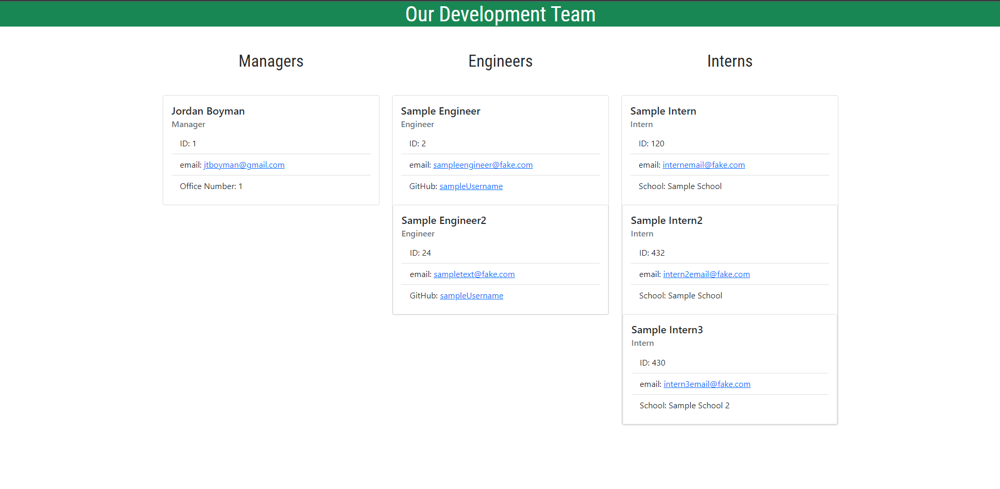

  # Team Profile Generator
  

  ## Table of Contents:
  * [Description](#description)
  * [Installation](#installation)
  * [Usage](#usage)
  
 * [License](#license)
  * [Contributors](#contributors)
  * [Tests](#tests)
  * [Questions](#questions)
  
  ## Description:
  The Team Profile Generator App is a node application the generates HTML based on user input. It prompts the user for information about employees and allows them to create Managers, Engineers, or Interns, then writes the HTML file and copies its CSS stylesheet to the dist subdirectory, resulting in a neat and organized team profile.
  

  ## Installation:
  In order to utilize this app, you will need to ensure node.js in installed on your device. After ensuring node.js is installed, pull this repository to your local device. Navigate to the root directory of the app in your command line. You can then call the application from the command line using "node index".

  ## Usage:
  This is a command line application that obtains user information to generate HTML. After calling the application from the command line using "node index", complete the prompts that follow. The prompts will change based on the type of employee created. Employees can be created in any order, as the HTML will automatically format and organize managers, engineers, and interns. After creating the desired number of employees, the app will write the HTML file and copy its CSS stylesheet to the 'dist' subdirectory. For more detailed information, you can view the [video](https://watch.screencastify.com/v/hdnE7LNqBEGLRqngxvt2) in the [tests](#tests) section. 
    
  
 ## License:
  Licensed under the MIT license.

  ## Contributors
  If you would like to contribute to this project, please feel free to open issues on GitHub, or contact me with questions/ideas/concerns.

  ## Tests
  The following video demonstrates an example of how to use this app: [How to use the Team Profile Generator](https://watch.screencastify.com/v/hdnE7LNqBEGLRqngxvt2). You can refer to the HTML in the 'dist' directory as an example of the generated HTML.

  ## Questions
  You can reach me for additional questions at:
  * GitHub: [jtboyman](https://github.com/jtboyman)
  * Email: jtboyman@gmail.com
